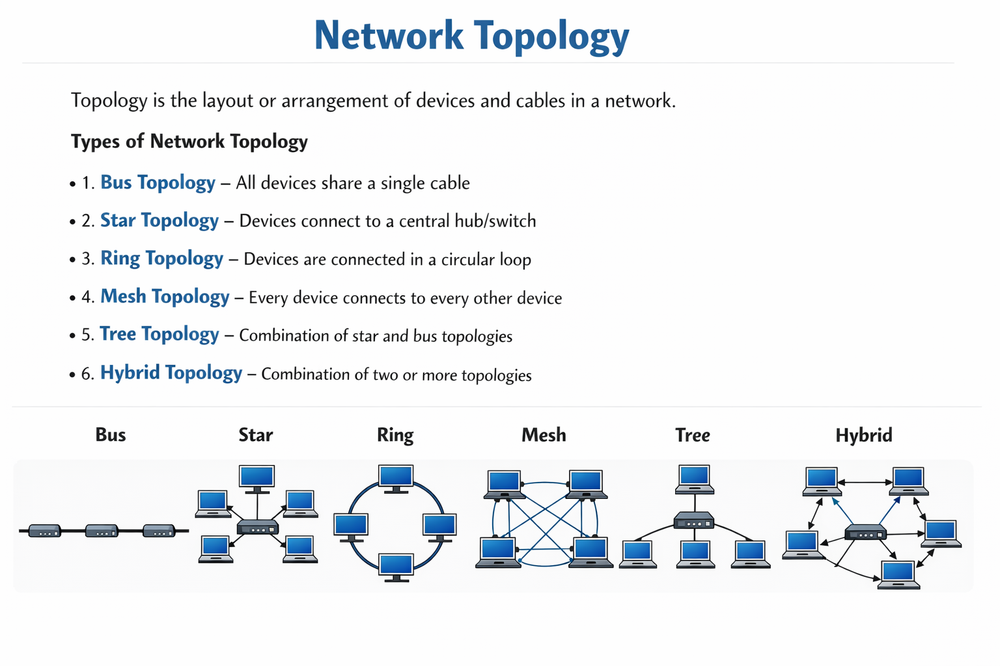
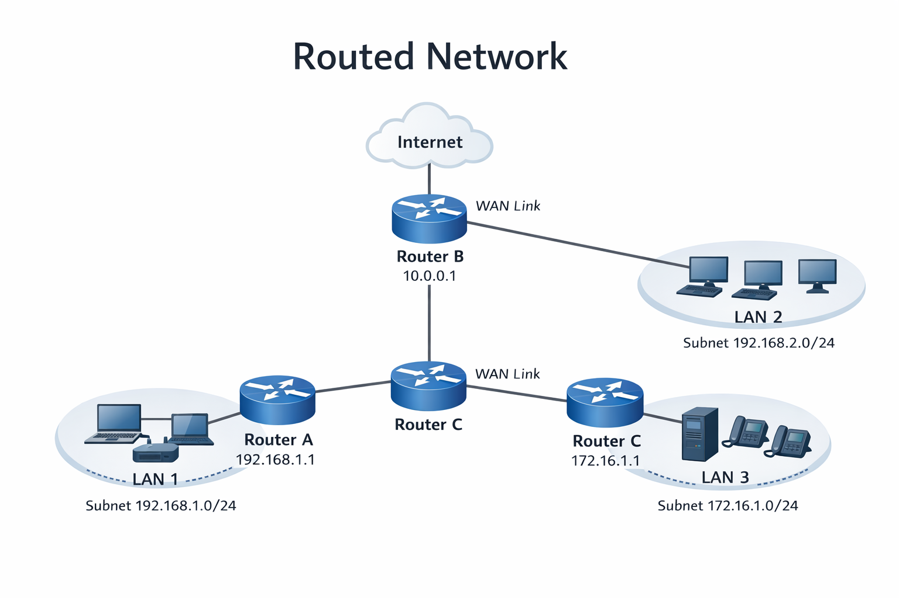
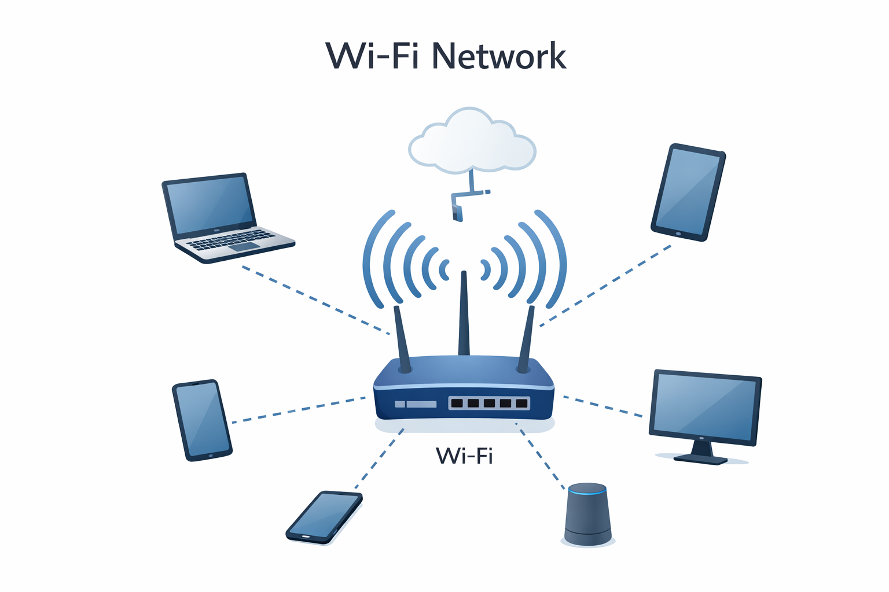

## Networking & Protocols

### What is Networking?
Networking is the process of connecting computers and devices to share data and resources.

### What is a Protocol?
A protocol is a set of rules that defines how data is transmitted and received between devices.

### Common Networking Protocols

**Application Layer**
- **HTTP / HTTPS** – Web communication  
- **FTP** – File transfer  
- **DNS** – Domain name to IP resolution  
- **SMTP** – Send emails  
- **POP3 / IMAP** – Receive emails  
- **SSH** – Secure remote access  

**Transport Layer**
- **TCP** – Reliable, connection-oriented communication  
- **UDP** – Fast, connectionless communication  

**Network Layer**
- **IP (IPv4 / IPv6)** – Device addressing and routing  
- **ICMP** – Network diagnostics (ping)

**Data Link Layer**
- **ARP** – IP to MAC address mapping

---

- **NIC (Network Interface Card):**  
  A hardware component that connects a device to a network.

- **MAC Address:**  
  A unique physical address assigned to a NIC for device identification.

- **IP Address:**  
  A logical address used to identify a device on a network and enable communication.

  ### Types of Networks

There are **5 main types of networks**:

1. **PAN (Personal Area Network)** – Very small range (e.g., Bluetooth)
2. **LAN (Local Area Network)** – Home, office, school
3. **MAN (Metropolitan Area Network)** – City-wide network
4. **WAN (Wide Area Network)** – Large geographic area (Internet)
5. **GAN (Global Area Network)** – Worldwide network

---
### Network Connectors

**Connectors** are hardware interfaces used to connect network cables to devices.

### Types of Network Connectors

1. **RJ45** – Used for Ethernet (LAN) cables  
2. **RJ11** – Used for telephone lines  
3. **Fiber Optic Connectors** – Used for high-speed networks  
   - SC
   - LC
   - ST
4. **BNC** – Used in older coaxial networks

---

### Ethernet Port

An **Ethernet port** is a physical interface on a device (like a computer, switch, or router) that allows connection to a **wired network** using an **Ethernet cable (RJ45)**.  

It enables devices to communicate over a **LAN** (Local Area Network) for data transfer, internet access, and networking.

### Ethernet Standards: 10BASE2 & 10BASE5

**10BASE2 (Thinnet)**
- Speed: 10 Mbps  
- Cable: Thin coaxial  
- Max Length: 185 meters  
- Connector: BNC  
- Used in small networks (rare today)

**10BASE5 (Thicknet)**
- Speed: 10 Mbps  
- Cable: Thick coaxial  
- Max Length: 500 meters  
- Connector: BNC  
- Used in older large networks

**Note:** Both are **old Ethernet technologies** and are mostly replaced by modern twisted-pair and fiber networks.

---

### Network Topology

**Topology** is the **layout or arrangement of devices and cables** in a network.

### Types of Network Topology

1. **Bus Topology** – All devices share a single cable  
2. **Star Topology** – Devices connect to a central hub/switch  
3. **Ring Topology** – Devices are connected in a circular loop  
4. **Mesh Topology** – Every device connects to every other device  
5. **Tree Topology** – Combination of star and bus topologies  
6. **Hybrid Topology** – Combination of two or more topologies

---

### Types of Network Communication

1. **Unicast**  
   - Data is sent from **one sender to one specific receiver**.  
   - Example: Sending an email to one person.

2. **Broadcast**  
   - Data is sent from **one sender to all devices** in the network.  
   - Example: ARP request in a LAN.

3. **Multicast**  
   - Data is sent from **one sender to a specific group of devices**.  
   - Example: Streaming a live video to selected users.

---

### Bridges vs Switches

**Bridge:**  
A **bridge** is a network device that **connects two LAN segments** and **filters/forwards data** based on MAC addresses.  

**Switch:**  
A **switch** is a network device that **connects multiple devices** within a LAN and **forwards data efficiently** using a MAC address table.

| Feature          | Bridge                          | Switch                          |
|-----------------|---------------------------------|--------------------------------|
| Purpose          | Connects **two LAN segments**   | Connects **multiple devices** within a LAN |
| Data Forwarding  | **Filters and forwards** data based on MAC address | Forwards data based on **MAC address table** |
| Ports            | Usually **2 ports**             | **Many ports** (4, 8, 16, etc.) |
| Speed            | Slower, older technology        | Faster, modern devices         |
| Layer            | Operates at **Data Link Layer (Layer 2)** | Operates at **Data Link Layer (Layer 2)** |
| Usage            | Rarely used today               | Common in modern networks      |

---

### Full Forms of Networking Terms

- **NIC** → Network Interface Card  
- **MAC** → Media Access Control  
- **IP** → Internet Protocol  
- **FTP** → File Transfer Protocol  
- **HTTP** → HyperText Transfer Protocol  
- **HTTPS** → HyperText Transfer Protocol Secure  
- **DNS** → Domain Name System  
- **TCP** → Transmission Control Protocol  
- **UDP** → User Datagram Protocol  
- **SMTP** → Simple Mail Transfer Protocol  
- **POP3** → Post Office Protocol version 3  
- **IMAP** → Internet Message Access Protocol  
- **SSH** → Secure Shell  
- **TELNET** → Telecommunication Network  
- **ARP** → Address Resolution Protocol  
- **ICMP** → Internet Control Message Protocol  
- **PAN** → Personal Area Network  
- **LAN** → Local Area Network  
- **MAN** → Metropolitan Area Network  
- **WAN** → Wide Area Network  
- **GAN** → Global Area Network  
- **VLAN** → Virtual Local Area Network  

---

### Managed vs Unmanaged Switches

**Unmanaged Switch:**  
- A basic switch that **automatically connects devices**.  
- No configuration needed.  
- Ideal for **small home or office networks**.  
- Cheaper and simple to use.

**Managed Switch:**  
- A switch that allows **configuration and control** of the network.  
- Supports **VLANs, QoS, port monitoring, and security settings**.  
- Ideal for **larger or business networks**.  
- More expensive but provides **better control and performance**.

| Feature           | Unmanaged Switch        | Managed Switch                    |
|------------------|-----------------------|----------------------------------|
| Configuration     | None                  | Configurable                     |
| Control           | Basic plug-and-play   | Advanced control over traffic    |
| Features          | Minimal               | VLANs, QoS, Security, Monitoring|
| Cost              | Low                   | High                             |
| Use Case          | Small networks        | Medium to large business networks|

---

### Routed Network

---

### Dedicated Firewall

A **dedicated firewall** is a **separate hardware device** designed solely to **monitor and control incoming and outgoing network traffic**.  
- Protects networks from unauthorized access.  
- Provides better performance and security than software firewalls.

---

### IPs vs IDs

| Feature       | IP (Internet Protocol)                  | ID (Identifier)                        |
|---------------|----------------------------------------|----------------------------------------|
| Meaning       | Logical address for devices on a network | Unique identifier for a device/user within a system |
| Purpose       | Identifies **where a device is located** | Identifies **who or what the device/user is** |
| Format        | IPv4: 192.168.1.1, IPv6: 2001:db8::1  | Could be alphanumeric (userID, MAC ID) |
| Scope         | Networking / Internet                  | Local system / application             |

---

### Wi-Fi (Wireless Fidelity)

**Wi-Fi** is a technology that allows devices to **connect to a network wirelessly** using radio waves.  
- Common in homes, offices, and public spaces.  
- Connects devices to the internet without cables.  

**Figure: Wi-Fi Network**  

